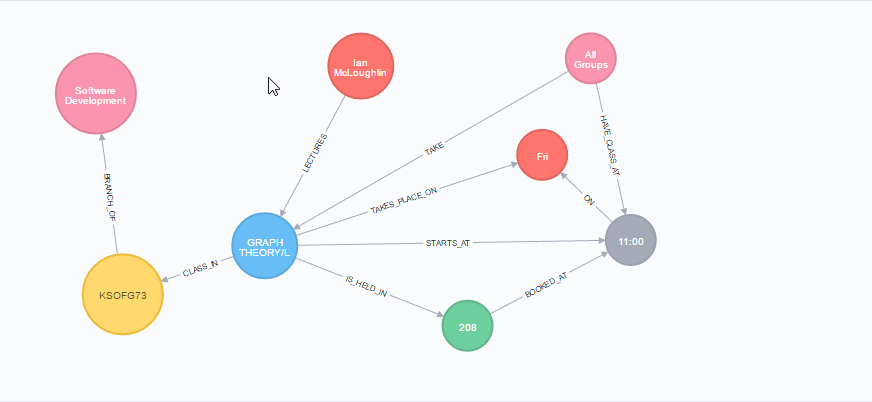

# Graph Theory - GMIT Timetable:
This is a time tabling system that displays relievent information for Software Development and Digital Media courses.

This can be used to display data like rooms,modules,course codes etc.

The Noe4j database is stored in a .zip folder inside the Graph Theory project folder along with the documentation, other relivent files like the CSV or web crawler program are placed outside.

