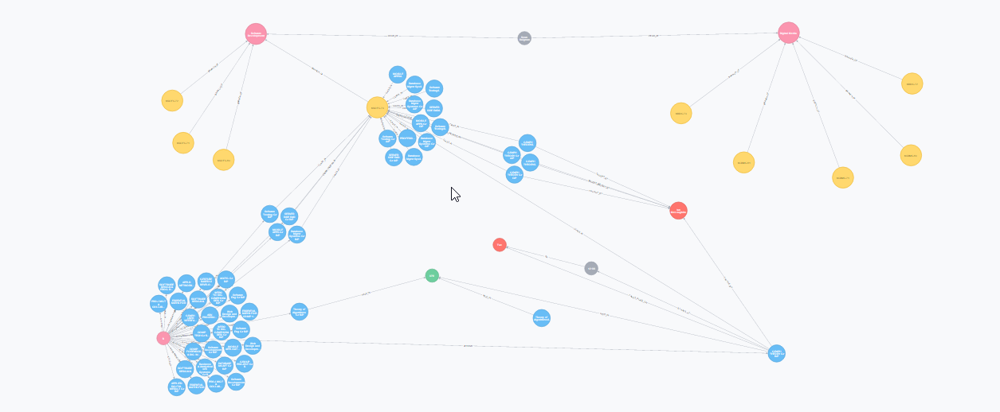
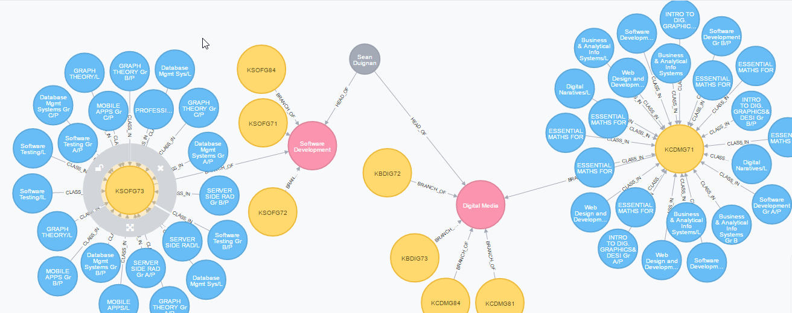
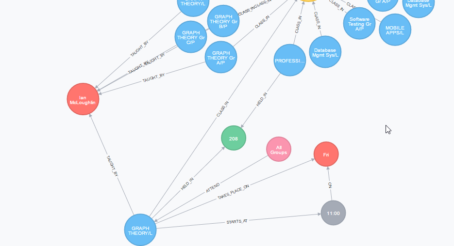

# Graph Theory - GMIT Timetable:
This is a time tabling system that displays relievent information for semester 2 of the Software Development and Digital Media courses in GMIT.

The Neo4j database is stored in a .zip folder inside the Graph Theory project folder along with the documentation.Other relivent files like the CSV files, the web crawler program and a example html of the timetable source used to extract the data are included too.

## Documentation headers:
1. Introduction.
2. Technologies Used.
3. Planning and architecture.
4. Extracting data.
5. Developmetal stage:
6. Testing the database.
7. Known Bugs and design flaws.
8. Final Build.
9. Conclusion.
10. References.

## Graph database images:

---

---
